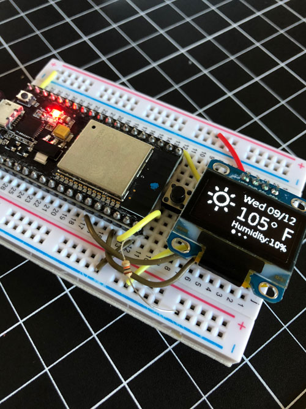

## Weather Station Widget
---
This widget will tell you the current weather as well as a 3 day forcast and the phase of the current moon.

## API's
---
It uses the Darksky Free API to gather all its data.

https://darksky.net/

https://api.darksky.net/forecast/[API_KEY]/33.307575,-111.844940?exclude=minutely,hourly,alerts,flags

## Drivers
For the ESP32 you might need to install drivers for the USB
https://www.silabs.com/products/development-tools/software/usb-to-uart-bridge-vcp-drivers

## Libraries
---
I used ArduinoJson lib (5.13.5) to parse the response from the API, the WiFI lib to connect to the WiFi Access Point. 

The https://github.com/ThingPulse/esp8266-oled-ssd1306 is a great LCD lib to allow the ESP32 to chip to easily communitcate with the display

ESP32 chip install
https://dl.espressif.com/dl/package_esp32_index.json

I wrote my own font lib and graphics lib for the graphics using:

http://oleddisplay.squix.ch/#/home for fonts and

http://chilipeppr.com/esp32 to convert the images

Images are in `WeatherGraphics.h` and `MoonPhase.h`

``time.h`` and ``math.h`` are used to format the Unix time stamps to a readable date and round temperatures

```c
#include "WeatherGraphics.h"
#include "CustomDisplayFonts.h"
#include "MoonPhase.h"
#include <ArduinoJson.h>
#include <WiFi.h>
#include <HTTPClient.h>
#include "SSD1306.h"
#include "ArduinoSort.h"
#include "time.h"
#include "math.h"
```

## To Run Update
You will need to update the following items
```
[YOUR SECRET KEY]
[YOUR SSID NETWORK NAME]
[YOUR NETWORK PASSWORD]
```


